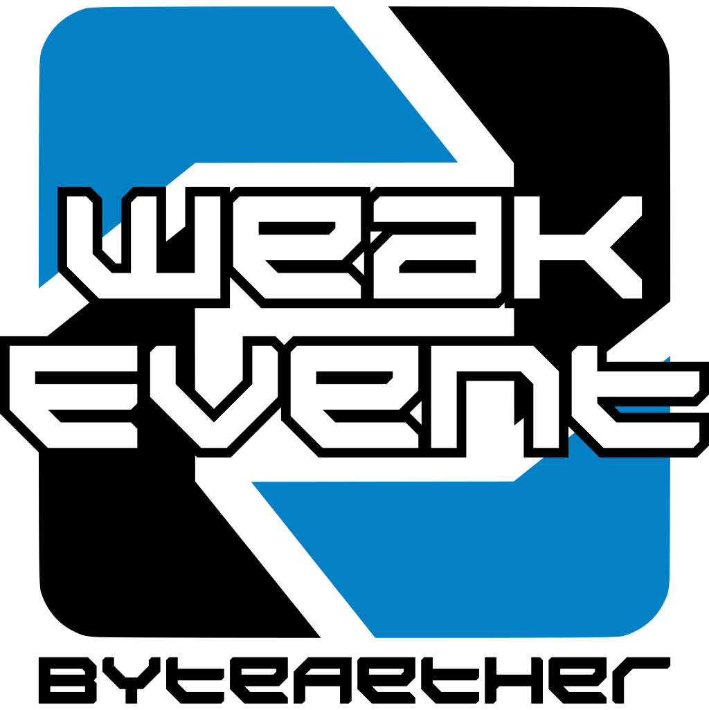

# 

[](https://github.com/ByteAether/WeakEvent/blob/main/LICENSE)
[](https://www.nuget.org/packages/ByteAether.WeakEvent/)
[](https://www.nuget.org/packages/ByteAether.WeakEvent/)
[](https://github.com/ByteAether/WeakEvent/actions/workflows/build-and-test.yml)
[](https://github.com/ByteAether/WeakEvent/actions/workflows/codeql.yml)

Weakly referenced event subscribers. Keep your .NET events lean and memory-safe.

## Introduction



The weak event pattern is a proven approach to managing event subscriptions in .NET, as detailed in Microsoft's documentation on [WPF weak event patterns](https://learn.microsoft.com/en-us/dotnet/desktop/wpf/events/weak-event-patterns?view=netdesktop-9.0). This design avoids memory leaks by holding event subscribers with weak references, which means that even if an object remains subscribed to an event, it can still be garbage collected when no longer in use.

Leveraging the power of .NET's weak reference mechanism, as explained in the [.NET garbage collection documentation](https://learn.microsoft.com/en-us/dotnet/standard/garbage-collection/weak-references), the WeakEvent library ensures that event subscribers do not prevent the garbage collector from reclaiming memory. This decoupling of publishers and subscribers provides a robust solution for managing event lifecycles without the need for manual unsubscription.

In the context of Blazor components, this functionality is particularly valuable. When using Blazor, developers often face challenges with unsubscribing from events during component disposal. With WeakEvent, you can safely subscribe to events in your Blazor components without worrying about leftover subscriptions that could block garbage collection. This ensures that unloaded components are properly cleaned up, preventing the accumulation of dead components in memory and avoiding potential memory leaks.

## Features


- **Weak References:** Subscribers are held via weak references, allowing the garbage collector to reclaim them when they are no longer needed.
- **Events With or Without Data:** Use `WeakEvent<TEvent>` when you need to pass event data to subscribers, or `WeakEvent` for simple notifications that don't require additional information.
- **Automatic Cleanup:** Dead subscribers (whose targets have been garbage-collected) are automatically removed when the event is raised.
- **Simple API:** Intuitive methods for subscribing, unsubscribing, and sending events.

## Installation

Install the latest stable package via NuGet:

```sh
dotnet add package ByteAether.WeakEvent
```

Use the `--version` option to specify a [preview version](https://www.nuget.org/packages/ByteAether.WeakEvent/absoluteLatest) to install.

## Usage

### Using the `WeakEvent`

```csharp
using ByteAether.WeakEvent;

// Create an instance of the weak event without event data
var myEvent = new WeakEvent();

// Create a subscriber and subscribe
var subscriber = () => Console.WriteLine("Event received!");
myEvent.Subscribe(subscriber);

// Raise the event
myEvent.Send();
```

### Using the `WeakEvent<TEvent>`

```csharp
using ByteAether.WeakEvent;

// Create an instance of the weak event with event data
var myEvent = new WeakEvent<MyEventData>();

// Create a subscriber and subscribe
var subscriber = (MyEventData data) => Console.WriteLine("Received: " + data.Message);
myEvent.Subscribe(subscriber);

// Raise the event
myEvent.Send(new MyEventData("Hello, World!"));

// Define your event data
public record MyEventData(string Message);
```

## API

### `WeakEvent<TEvent>`
 * `Subscribe(Action<TEvent> handler)`
    * Subscribes the specified handler to the event. The handler will be invoked when the event is raised, provided that its target is still alive.
 * `Unsubscribe(Action<TEvent> handler)`
   * Unsubscribes the specified handler from the event.
 * `Send(TEvent eventData)`
   * Raises the event by invoking all live subscribers with the provided event data. Dead subscribers (whose targets have been garbage-collected) are removed.

### `WeakEvent`
 * `Subscribe(Action handler)`
   * Subscribes the specified handler to the event. The handler will be invoked when the event is raised, provided that its target is still alive.
 * `Unsubscribe(Action handler)`
   * Unsubscribes the specified handler from the event.
 * `Send()`
    * Raises the event by invoking all live subscribers. Dead subscribers (whose targets have been garbage-collected) are removed.

## Contributing

We welcome all contributions! You can:

 * **Open a Pull Request:** Fork the repository, create a branch, make your changes, and submit a pull request to the `main` branch.
 * **Report Issues:** Found a bug or have a suggestion? [Open an issue](https://github.com/ByteAether/WeakEvent/issues) with details.

Thank you for helping improve the project!

## License

This project is licensed under the MIT License. See the [LICENSE](LICENSE) file for details.